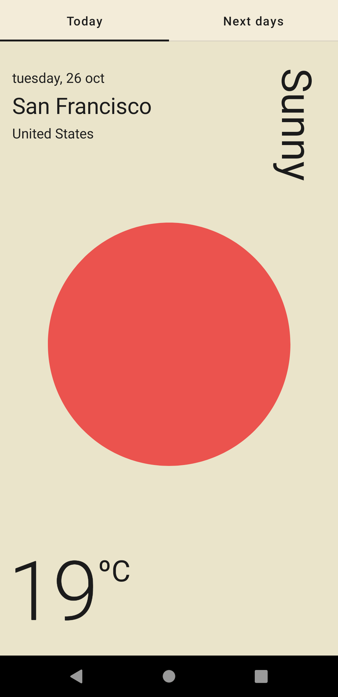
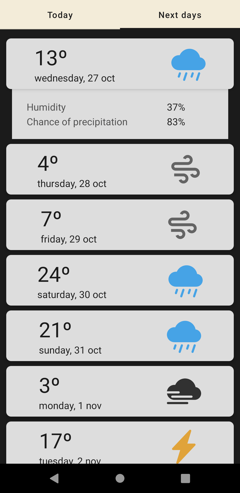
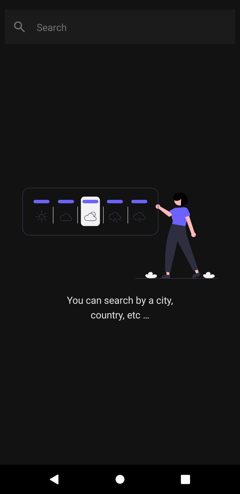

# :partly_sunny: Weather App

Interface based in [this one](https://www.behance.net/gallery/115013639/Weather-App)

| What | Build with |
| --- | --- |
| :construction: Architecture | [MVVM](https://developer.android.com/topic/libraries/architecture/viewmodel) |
| :syringe: DI | [Hilt](https://developer.android.com/training/dependency-injection/hilt-android) |
| :paintbrush: Interface | [Jetpack Compose](https://developer.android.com/jetpack/compose) |
| :round_pushpin: Navigation | [Compose Navigation](https://developer.android.com/jetpack/compose/navigation) |

## Screenshots

  
  
  

